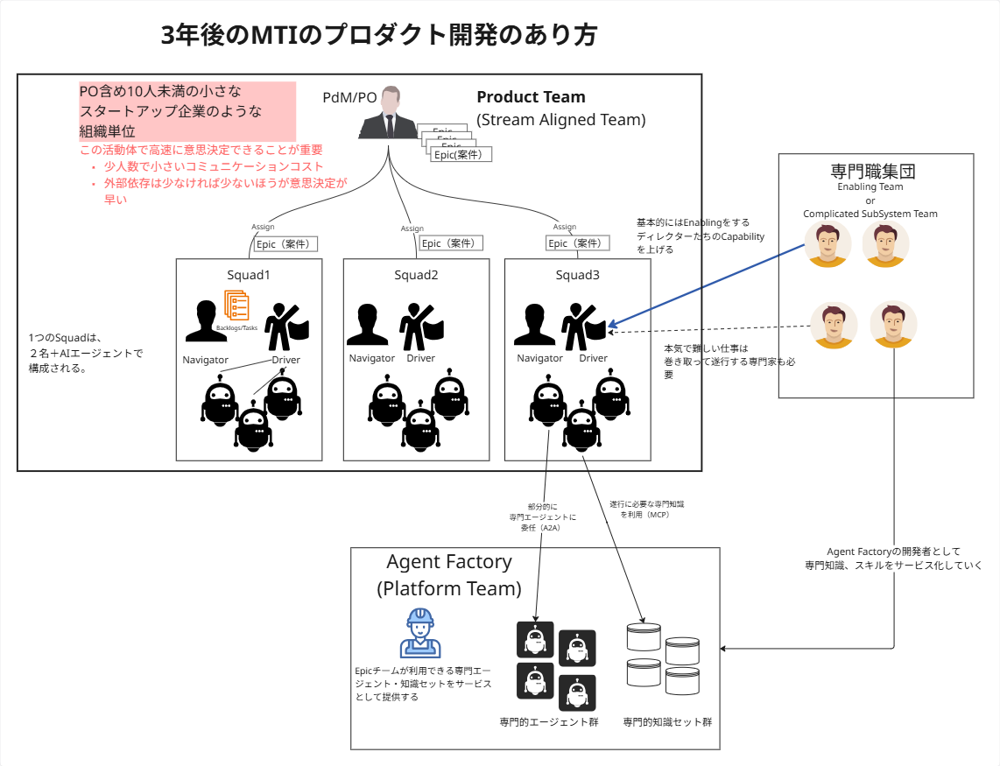

# Vision: なぜAI Readyを目指すのか

本ドキュメントは、「AI Ready」の先にある我々の**理想の未来像**、すなわち新しいプロダクト開発体制と、その働き方を定義するものです。

## 3年後のプロダクト開発のあり方

### このモデルがもたらす価値

*   **レバレッジ効果の最大化:** 「少ない人数で大きな成果を出す」という哲学に基づき、AIをパートナーとして個人の能力を拡張し、従来の常識を超える価値を創出します。
*   **圧倒的な開発速度:** AIとの協業により、アイデアから実装までのリードタイムを劇的に短縮します。
*   **高速な意思決定:** POを中心とした少人数チームでの密なコミュニケーションにより、的確かつ迅速な意思決定が行われ、これにより高速なプロダクト開発サイクルが生まれます。
*   **人と武器の継続的強化:** Enabling Teamによるスキル移転で「個の能力」を高め続け、Agent Factoryが供給する「領域特化型AIエージェント」という強力な武器を使いこなすことで、チームは学習し、進化し続けます。

この組織図は、迅速な意思決定と高い生産性を両立させるための、新しいプロダクト開発モデルです。これは、POを社長と見立てた、10人未満程度の小さなスタートアップ企業のような単位（Product Team）が、自律的に開発を進めることを特徴とします。

## 主要な構成要素

### 主役

1.  **Product Team (Stream Aligned Team):**
    *   PdM/PO（プロダクトマネージャー/プロダクトオーナー）が率い、複数の **Squad** で構成されます。

2.  **Squad:**
    *   1つのSquadは「Navigator」「Driver」と呼ばれる2名の人間と、複数の「AIエージェント」で構成されます。
    *   POから直接Epic（案件）を割り当てられ、自律的に開発を進めます。
    *   少人数であることでコミュニケーションコストを下げ、外部依存を減らし、意思決定を高速化します。

### 後方支援

3.  **Agent Factory (Platform Team):**
    *   専門家の知見をスケールさせ、全てのSquadがトップレベルの開発ツールや知識を手軽に利用できる**環境を構築します。**

4.  **専門職集団 (Enabling Team):**
    *   Squadの能力を引き上げる「コーチ」と、困難な課題を解決する「特殊部隊」の二つの役割を担い、組織全体の成長と問題解決を加速させます。

## 目指す開発フロー

この開発フローの起点は、POによる継続的な戦略策定です。

1.  **[PO] 戦略策定と計画:**
    - POはプロダクトの中長期計画を常に検討し、プロダクトの成長計画をEpicバックログとして管理します。
    - 各Epicについて、狙いとビジネス上の価値を明確にするための「インセプションデッキ」を主催します。
    - Epicの実行優先度を決定し、担当Squadに遂行を委任します。
2.  **[Squad] 高速な開発サイクル:**
    - SquadはNavigatorとDriverがペアとなり、担当したEpicの責任者として遂行します。
    - AIエージェントと対話しながら、超高速で意思決定と実装を繰り返します。
3.  **[Agent Factory] 専門知識の活用:**
    - 開発の過程で、SquadはAgent Factoryが提供するドメイン特化型AIエージェントや知識セットを「強力な武器」として利用し、生産性を加速させます。
4.  **[Enabling Team] 支援とスキル移転:**
    - 原則として、Enabling TeamはSquadの自走力を高めることを優先します。コーチング、ナレッジ整備、運用手順の提供などを通じて、Squadが同様の課題を自ら解決できるようスキル移転を行います。
    - それでも解決が困難な場合に限り、Enabling Teamは直接的に介入（特殊部隊）して短期間で問題を解決します。
    - 介入後は、得られた知見をSquadとAgent Factoryへ横展開し、継続的な能力向上につなげます。

この一連のフローを通じて、人はより本質的な課題に集中し、AIは定型的な作業を担います。そして、Enabling Teamの活動によって生み出された新たな知見は、再びAgent Factoryを通じて組織全体の「武器」として還元され、システム全体が継続的に進化していきます。

---

### コラム：3年後の、さらに先へ

ここで示した3年後の姿は、我々が目指す未来への、あくまで一つの通過点に過ぎません。

究極の理想は、組織という概念すら超え、個々人がAIを最高のパートナーとして自らの能力を無限に拡張し、一人ひとりが独立した事業体のように、あらゆる価値を創造できる世界です。

本ドキュメントで定義する体制やフローは、その壮大な未来へ到達するための、現実的かつ重要な第一歩と言えるでしょう。

---

## 全ては「AI Ready」から始まる

このVisionを実現するためには、まず我々自身がAIを効果的に活用できるスキル、マインドセット、そしてそれらを支える環境とガバナンス、すなわち **「AI Ready」** な状態になる必要があります。このドキュメント群は、その状態に至るための道標です。
